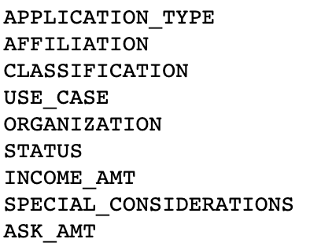
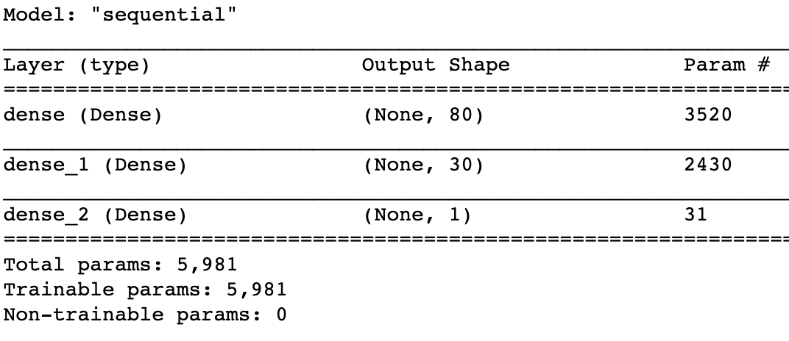
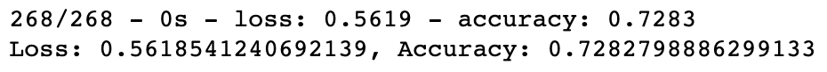

# Neural_Network_Charity_Analysis

## Analysis Overview
This analysis sought to create a predictive model for a specific bank’s customer database for whether a given loan would be paid back successfully. The model consisted of a Neural Network created via Tensorflow’s Keras package in python. The model took into account several different features, such as type of loan, various demographic information about the customer, and features relating to the respective loans taken by those customers. 

## Results

### Data Processing
<ul>
    <li><strong>What variable(s) are considered the target(s) for your model?</strong>  
    The target of the model was the "IS_SUCCESSFUL" feature. That is, the loan was paid back successfully.</li>
    <li><strong>What variables are considered features for your model?</strong>  
    While this list of potential features was updated throughout the testing phase in order to try to optimize the network, the following list were the final features for the model. 
     </li>
    <li><strong>What variables are neither targets nor features and should be removed from the input data?</strong>  
    This list was also updated throughout the testing process. At the end, the following two variables were the only removed (others were removed but then added back, explained below): the EIN and NAME variables. These variables were identifiers for the customer and had no bearing on the model target. </li>
</ul>

### Compiling, Training, and Evaluating the Model
<ul>
    <li><strong>How many neurons, layers, and activation functions did you select for your neural network model, and why?</strong>  
    The final model was compiled with the following parameters. 
    
    Several models were tried with 1, 2, and 3 hidden layers and with a host of different neurons with the biggest attempt that utilized 300 neurons over 3 levels. Given the data set, despite several manipulations and cleaning processes, the number of neurons or layers did not significantly improve the results of the model--just the time it took to run. Different activation functions met with similar results, though the Sigmoid activation function made the most sense statistically, and was corroborated through trial and error evaluation. </li>
    <li><strong>Were you able to achieve the target model performance?</strong>  
    Alas, no. Through many different parametric optimization techniques were tried, at no point in the process did the final result for the model did the accuracy score rise higher than 75%. At a few points during evaluation, checkpoints were saved with certain model weights producing an accuracy as high as 81%, but could not be recreated. </li>
    <li><strong>What steps did you take to try and increase model performance?</strong>  
    As mentioned above, the following steps were taken to different degrees:
    <ul>
        <li> Modifying the number of hidden layers, neurons and activation functions</li>
        <li> Reclassifying certain diverse variables, such as application type and class type, to have more and fewer levels</li>
        <li> Removing certain variables that seemed inconsequential. (Ultimately, they were added back save for EIN and NAME due to the lack of impact on the model.)</li>
    </ul>
    <li>
</ul>

## Summary
At the end of the process, the best accuracy scores achieved through this model were comparable to the last run that resulted in the following accuracy score. 

Due to the poor score and lack of headway through optimization efforts, it appears that a more robust data set is necessary to really actualize the potential of this neural network. In leu of more data, I would recommend boosting be implemented to increase the size of the data if the neural network model is the desire. However, given the constraints of this data set, I would recommend a random forest classifier or a logistic classifier as better potential models. Given the size of this dataset, both RFC and logistic classifiers play well with EEN data and would run much more efficiently and accurately. 